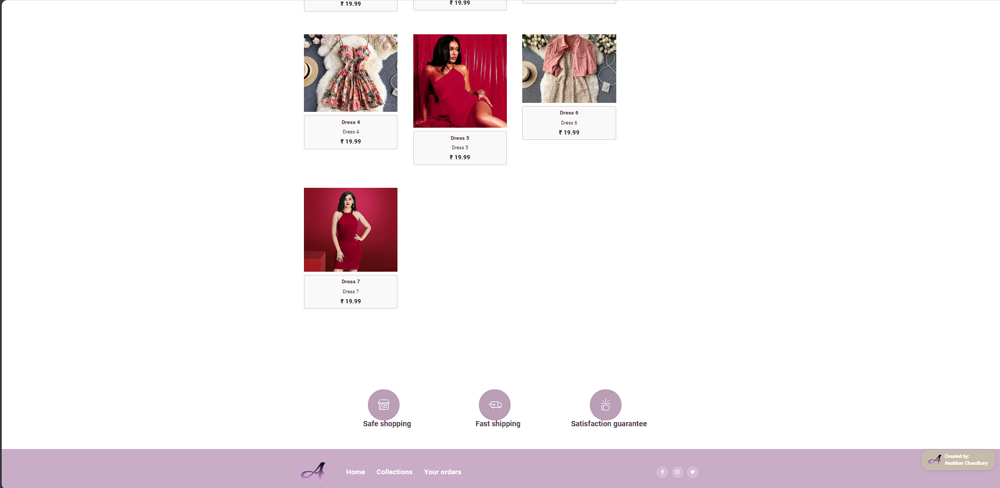
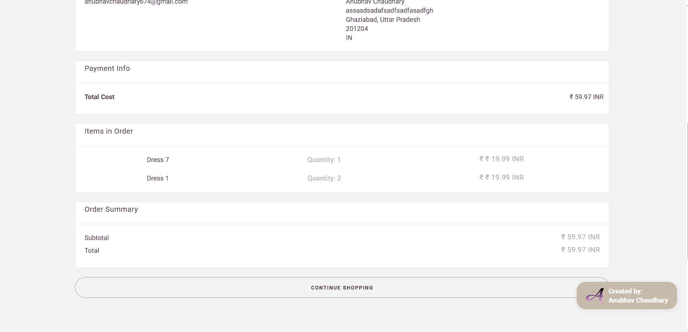

<p align="center">
  
</p>
<p align="center">
  <a href="https://anubhavchaudhary.42web.io">
    
  </a>
  <p align="center">Easy to use, open source, E-commerse Site.</p>
</p>
<p align="center">
  <b>
    <a href="https://anubhavchaudhary.42web.io">Website</a> |
    <a href="">Documentation</a> | 
    <a href="">Roadmap</a>
  </b>
</p>

# E-commerse-site-
A Angular js full stack E-commerse site for Designers to sell their designs and can make their small offline bussiness online . Techs  used is Html, Css ,Java script , Angular js,node js ,express ,MySql.

### Screenshots

**1. A real landing page **








## Features
1.E-commerse dashboard

2.Cart

3.Orders history

4.Checkout option

5.Jwt Authentication


## Tech Stack

```sh
    "@angular/animations": "^17.1.0",
    "@angular/cdk": "^17.3.5",
    "@angular/common": "^17.1.0",
    "@angular/compiler": "^17.1.0",
    "@angular/core": "^17.1.0",
    "@angular/forms": "^17.1.0",
    "@angular/material": "^17.3.5",
    "@angular/platform-browser": "^17.1.0",
    "@angular/platform-browser-dynamic": "^17.1.0",
    "@angular/router": "^17.1.0",
    "axios": "^1.7.2",
    "bcrypt": "^5.1.1",
    "bcryptjs": "^2.4.3",
    "cookie-parser": "^1.4.6",
    "cors": "^2.8.5",
    "express": "^4.19.2",
    "jquery": "^3.7.1",
    "jsonwebtoken": "^9.0.2",
    "mdb-ui-kit": "^7.2.0",
    "mysql2": "^3.10.1",
    "rxjs": "~7.8.0",
    "sequelize": "^6.37.3",
    "sweetalert2": "^11.10.8",
    "tslib": "^2.3.0",
    "zone.js": "~0.14.3"
````

## Development

The project is organised as a mono-repo. It uses Npm workspaces for managing the mono-repo.

To set up the development environment, first clone the project on your local machine and `cd` to its diretory.

# Installation

- Clone the repo with

```bash
git clone https://github.com/chaudharyanubhavsingh/E-commerse-site-
```

- install all dependancies

```bash
       "@angular/animations": "^17.1.0",
    "@angular/cdk": "^17.3.5",
    "@angular/common": "^17.1.0",
    "@angular/compiler": "^17.1.0",
    "@angular/core": "^17.1.0",
    "@angular/forms": "^17.1.0",
    "@angular/material": "^17.3.5",
    "@angular/platform-browser": "^17.1.0",
    "@angular/platform-browser-dynamic": "^17.1.0",
    "@angular/router": "^17.1.0",
    "axios": "^1.7.2",
    "bcrypt": "^5.1.1",
    "bcryptjs": "^2.4.3",
    "cookie-parser": "^1.4.6",
    "cors": "^2.8.5",
    "express": "^4.19.2",
    "jquery": "^3.7.1",
    "jsonwebtoken": "^9.0.2",
    "mdb-ui-kit": "^7.2.0",
    "mysql2": "^3.10.1",
    "rxjs": "~7.8.0",
    "sequelize": "^6.37.3",
    "sweetalert2": "^11.10.8",
    "tslib": "^2.3.0",
    "zone.js": "~0.14.3"
```
```bash
ng serve
```


# Connect with me

<div>
<a href="https://www.linkedin.com/in/anubhav-chaudhary-533a66248" target="_blank">

</a>
<a href="https://github.com/chaudharyanubhavsingh" target="_blank">

</a>
<a href="https://www.instagram.com/chaudharyanubhavsinghh/?igshid=MjEwN2IyYWYwYw%3D%3D" target="_blank">

</a>
</div>


